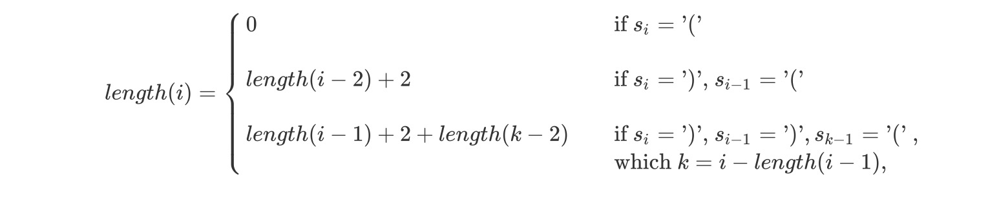

## 32. Longest Valid Parentheses

### Descripttion

Given a string containing just the characters `(` and `)`, find the length of the longest valid (well-formed) parentheses substring.

**Example 1:**

```
Input: "(()"
Output: 2
Explanation: The longest valid parentheses substring is "()"
```

**Example 2:**

```
Input: ")()())"
Output: 4
Explanation: The longest valid parentheses substring is "()()"
```

### Analysis


Given above $str$, we create an array `length` to store the max length of every index of the string. So the value of `length(i)` has the next formula.

